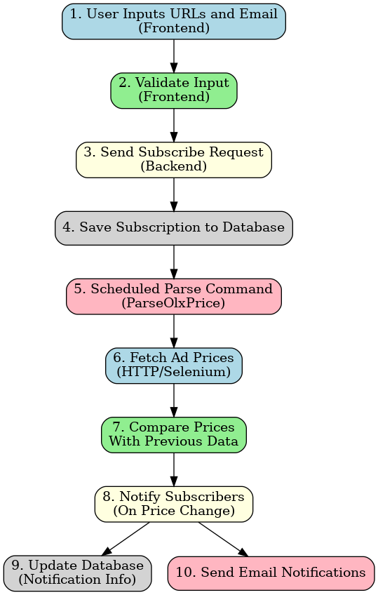

# OLX Price Monitor

## About

This project monitors price changes on OLX advertisements and sends email notifications when a price change is detected. It is built using this stack:
* [Laravel](https://laravel.com/) 11 with [Blade templates](https://laravel.com/docs/11.x/blade#main-content),
* [Tailwindcss](https://tailwindcss.com/)
* [AlpineJS](https://alpinejs.dev/)

Although OLX do have a [public API](https://developer.olx.ua/api/doc), it only allows to deal with user's own advers, so that non-user advers can not be retrieved even with GET routes. So it was decided to parse OLX prices from data on advert web page. Luckily, every OLX advert page has `<script>` with type `ld+json`. It's loaded statically and contains all advert data in json format.

For advert page parsing it was decided to implement two services - based on:
* [Selenium Server (Grid)](https://www.selenium.dev/documentation/grid/),
and
* some PHP HTTP Client, I chose [Guzzle HTTP](https://docs.guzzlephp.org/en/stable/) for simplicity and for the fact that OLX price data can be retrieved from static page (no need to deal with dynamic page contents).

Later on, during numerous tests I found parsing with _Selenium Server_ to be in most cases up to 3 times longer than with _GuzzleHTTP_ for the same advert pages. So I made parsing with HTTP client a default method for the service (although keeping choosing the other option possible).

## General Project Flowchart

Below is a flowchart illustrating the process flow of the Price Monitoring Service:



### Block Descriptions:

1. **User Inputs URLs and Email (Frontend)**

    The user provides the URLs of the items to monitor and their email address for notifications. These inputs are collected through the frontend form.

2. **Validate Input (Frontend)**

    The input is validated on the client side to ensure correct data format (e.g., valid URLs and email addresses).

3. **Send Subscribe Request (Backend)**

    After successful frontend validation, a request is sent to the backend to save the subscription details.

4. **Save Subscription to Database**

    The backend validates the data further, then saves the subscription information (URLs and email) into the database. 
   
    For each new subscriber (new email address) a validation email is sent with a link to validate email, and user is notified back on subscription webpage about this. <span style="color:red">Only subscriptions with validated emails is processed with price monitoring service.</span>

5. **Scheduled Parse Command (ParseOlxPrice)**

    A scheduled command (ParseOlxPrice) runs periodically to fetch and monitor the prices of the subscribed items.

6. **Fetch Ad Prices (HTTP/Selenium)**

    The command fetches the latest prices for each subscribed URL, either through HTTP requests (default) or by using Selenium Server. Each adv URL is checked against its _validity_ - e.g. the adv itself could be removed at time of parsing etc. Service detects such cases and marks invalid urls, so that they won't be processed in future service runs.
    
    Of course, the same URL may appear in different subscriptions (different users have the same URL in their list), so the service assures that each URL will be parsed only once during service run.

7. **Compare Prices With Previous Data**

    The fetched prices are compared with the previously stored prices in the database to detect changes.

8. **Notify Subscribers (On Price Change)**

    Only if a price change is detected, the system prepares a notification for the subscriber, including the updated price information. If a subscriber have several advers where prices changed, information of all those advers will be combined in a single notification for that subscriber (to reduce overhead and user experience).  

9. **Update Database (Notification Info)**

    The database is updated with the notification details, including timestamps and other metadata for tracking.

10. **Send Email Notifications**

    The notification is sent to the subscriber's email using the queued mail system.


## Requirements

- PHP 8.1+
- Composer
- Laravel 11
- MySQL or another supported database
- Node.js (for frontend assets)

## Installation

1. Download the project (or clone using GIT):
    ```bash
    git clone https://github.com/ur7ez/parse-price-test.git
    ```
2. Copy `.env.example` into `.env` (```cp .env.example .env```) and edit `.env` file to configure your environment:
   * set up DB connection. For DB do not use `sqlite` - queue worker will not work with it. Use `DB_CONNECTION=mysql` and add other DB credentials.
   * configure your mail settings to enable email notifications (I used [Mailtrap](https://mailtrap.io/) free service for testing)
3. Navigate to the project's root directory using terminal and run
 `composer install`
4. Set the encryption key by executing `php artisan key:generate --ansi`
5. Run DB migrations `php artisan migrate`
6. Start local server by executing `php artisan serve`
7. To install frontend dependencies, open new terminal and navigate to the project root directory
8. Run `npm install`
9. Run `npm run dev` to start vite server for Laravel frontend

## Set up Queue Worker

Email notifications are being sent with queue (`ParseOlxPrice` Command class queues emails) to optimize performance, so you need to set up queue worker. 
* If you prefer Redis for queueing, install it and update `.env` with `QUEUE_CONNECTION=redis` 
* Use Laravel Queue Worker to start listening for a queued jobs:
    
```php artisan queue:work```

## Set up Scheduler

If you want to run the scheduled task to monitor prices periodically, you must run the Laravel scheduler.
To run a scheduled worker locally, in new terninal window run:

```php artisan schedule:work```

This command will run in the foreground and invoke the scheduler every minute until you terminate the command.

 To run scheduled tasks once (without worker), use:

`php artisan schedule:run`

Or you may set up cron job manually like this:
```bash
 while true; do php artisan schedule:run; sleep 60; done
 ```
By default, price monitoring is scheduled with [HTTP service](app/Services/HttpService.php) parser, and will run every hour. 
Parser logs will be output to [parse_olx_price.log](storage/logs/parse_olx_price.log), but you can change it in `routes/console.php`.

## Testing the System

If you wish to test the OLX price monitoring manually, you can run the command:
```bash
php artisan schedule:test --name="parse:olx-price --method=http"
```
You still need queue worker running for this (to send notifications to subscribers).
If everything is set up correctly, the prices will be monitored, and notifications will be sent when a price change is detected.
If no argument passed to this command, HTTP service is used for price parsing. Alternatively, you can pass merhod argument to choose parsing with Selenium server: ` --method=selenium`.
But before this, make sure Selenium Server is running, e.g. within Docker container, for example with this command:

```bash
docker run -d -p 4444:4444 -p 7900:7900 --shm-size="2g" selenium/standalone-chrome:latest
```

## Usage

### Subscribing for Price Notifications
* To subscribe to price notifications, a user can submit one or many OLX ad URLs at once through the frontend (form).
* To verify new subscription email, user will receive email notification with verification link. 
* Only after email is verified, its subscribed adv URLs will be allowed for price monitoring service.
* The service will automatically monitor the price for newly added subscriptions and notify the user if the price changes.

### Monitoring Prices

* The system will run monitoring the prices every hour (or as configured in routes/console.php). 
* Period to trigger new price check for each adv URL is set to 2 hours by config parameter `max_url_age` in [config/parser.php](config/parser.php)
* You can manually trigger the price monitoring by running `php artisan parse:olx-price`. By default, this command uses [HTTP service](app/Services/HttpService.php) (method option `--method=http`) but also `--method=selenium` option possible (much slower!).

## Notifications

The application will send email notifications when the price of a monitored ad changes. The email contains the old and new prices along with the URL of the ad.


## TODO List

This features from [complications list](docs/original_task.md#complications) are not implemented as yet:
* make a full-fledged service that run in Docker container
* make PHPUnit tests to cover >70% of code


## _Original Task Description_

For initial task description look [here](docs/original_task.md).
